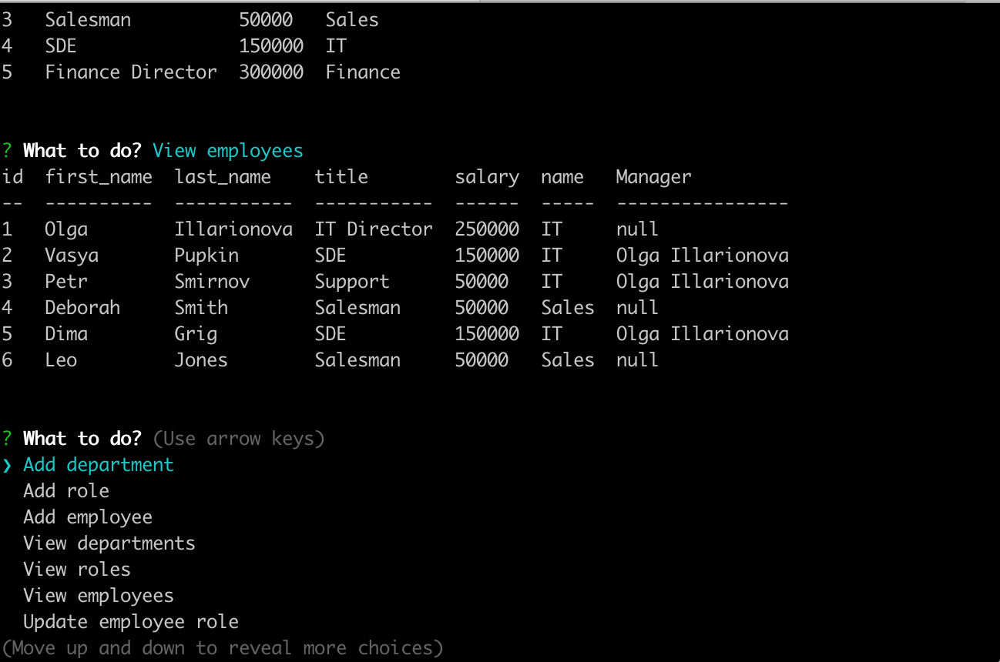

# Employees database 
  CLI for database that contains employees info. Program allows view and add information.
  # Table of Contents
  1. [Installation](#installation)
  2. [Usage](#usage)
  3. [License](#license)
  4. [Detailed Description](#detailed-description)
  5. [Future Improvements](#future-improvements)
  6. [Questions](#questions)
## Installation
To install please use: 
`npm init` then  `npm install`
## Usage
1. Create database using schema provided in `empl.sql`. `seed.sql` example of creating initial database content.
2. Create `.env` file that will contains user and password for database connection.
3. To run CLI use 
`node index.js`
## License
[License: MIT](https://opensource.org/licenses/MIT)
## Detailed Description
Command line interface for work with employee database. Database contains 3 tables: Employees, Roles, Departments. Program allows to view info about Employees, Roles, Departments and add new entities into these tables.
View of tables is human-readable, for example, you will see in Roles view not Foreign Key for Departments table but Departments name. 

You can see video example [here](https://drive.google.com/file/d/19HtlXhRFX4CAsTmcP3JpHKDJt0JPDZ_w/view?usp=sharing) 
## Future Improvements
In future plans implement: deleting items, upgrading Managers, validating inputs.
## Questions
For questionts please contact [me](https://github.com/Myau5x) at ola.illari@gmail.com
 

